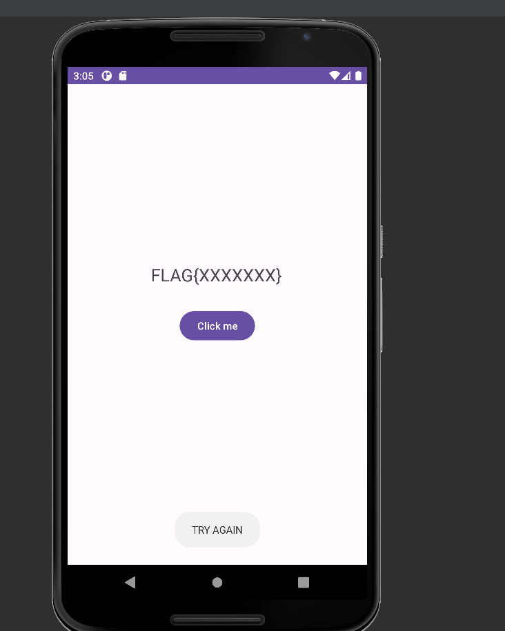
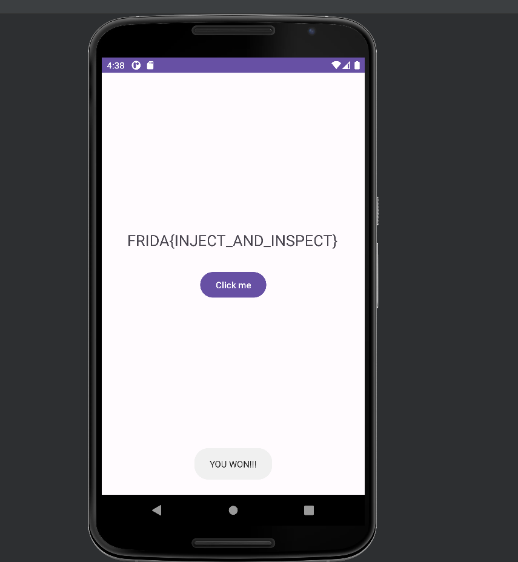
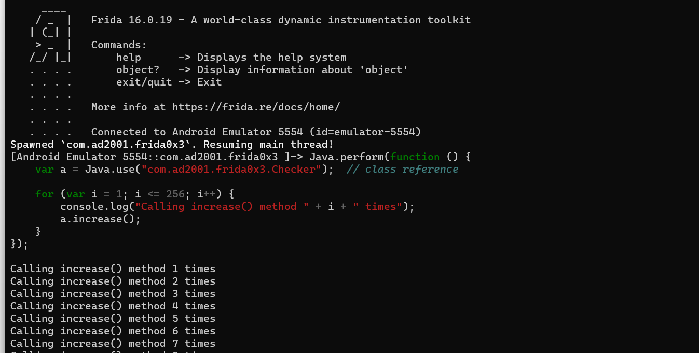
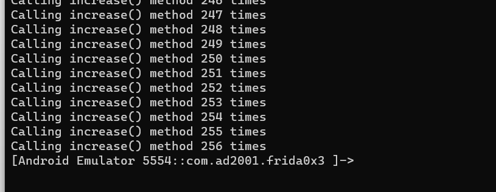

## Prerequisites  

- Basics of Reverse Engineering using jadx.
- Proficiency in reading and understanding Java code.
- Capability to write small JavaScript snippets.
- Familiarity with adb.
- Rooted device.

## Challenge 0x3

Let's start with our apk. So let's install the application and take a look.



The application has a button and a TextView. The TextView provides a  hint about the flag. There's no EditText to input anything. If you click on the  button, it says "TRY AGAIN." Let's stop wasting time analyzing this and  move on to reversing it using JADX.

Let's load the application into jadx.


This time we have an extra class. Let's take a look at `Checker`.


In this class, there's a static int variable called `code` assigned a value of 0. Additionally, there's a static method named `increase()`. This method simply adds two to the `code` variable when called. This method is not called anywhere in the application so the value of `code` variable won't get changed.

Let's inspect the code in`MainActivity`.

```java
   btn.setOnClickListener(new View.OnClickListener() { // from class: com.ad2001.frida0x3.MainActivity.1
            @Override // android.view.View.OnClickListener
            public void onClick(View v) {
                if (Checker.code == 512) {
					....
                    ....
                    ....
                }

```

When the button is clicked, it checks whether the `code` variable in the `Checker` class is equal to `512`. If this condition is met, it displays a toast with the message "You won," decrypts the flag, and sets the resulting text in the TextView. Otherwise, it will show a toast with the message "TRY AGAIN."

There are two main ways to solve it. 

- Changing the value of `code` variable directly to `512` using frida.
- Calling the `increase()` method 256 times.

## Changing the value of code variable

To obtain the flag, we need to set the value of our code variable to `512`. We can easily achieve this by changing the value of this variable using Frida. 

```
public class Checker {
    static int code = 0;

    public static void increase() {
       code += 2;
    }
}
```

Let's show you a basic template.

```
Java.perform(function (){
 
var <class_reference>= Java.use("<package_name>.<class>");
<class_reference>.<variable>.value = <value>;

})
```

Let's change the value of the code variable.

- Package name : `com.ad2001.frida0x3`
- Class name : `Checker`

```
Java.perform(function (){
 
var a= Java.use("com.ad2001.frida0x3.Checker");  //class reference
a.code.value = 512; 

})
```

So let's start frida and inject this code.

```
frida -U -f com.ad2001.frida0x3
```


Before hooking, if you click the button, it displays the message "TRY  AGAIN." Now, let's inject our code and see what happens.


Let's click our button again.



And we got the flag. That was easy right? 

Let's try the second way to solve it.

## Calling the increase() method

Another approach is to call the `increase()` method 256 times. Each invocation of this method increments the value of the `code` variable by 2. We already know how to invoke a method in Frida (as mentioned in the previous post), so to call the `increase()` method multiple times, we can simply use a loop.

Let's write the frida script.

- Package name : `com.ad2001.frida0x3`
- Class name : `Checker`
- Method name : `increase()`

```
Java.perform(function () {
    var a = Java.use("com.ad2001.frida0x3.Checker");  // class reference

    for (var i = 1; i <= 256; i++) {
        console.log("Calling increase() method " + i + " times");
        a.increase();
    }
});

```

Let's close our application and open again.

```
 frida -U -f com.ad2001.frida0x3
```

Now paste the script in the console.



We can see that our script starts calling the `increase()` method repeatedly.



Now let's click on our button. If the value of `code` is 256, then we will get the flag.


As expected, we got the flag. 