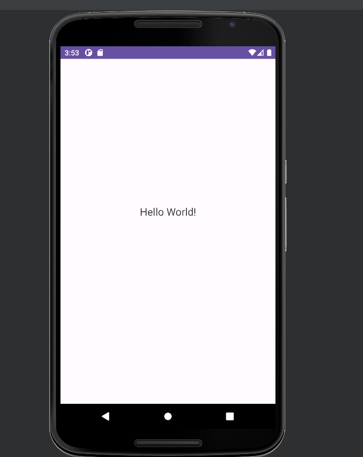
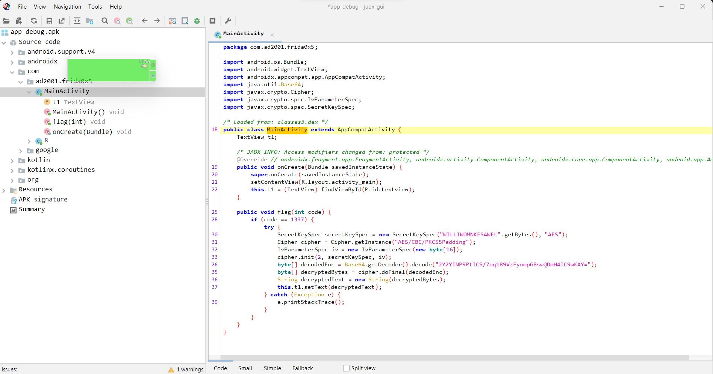
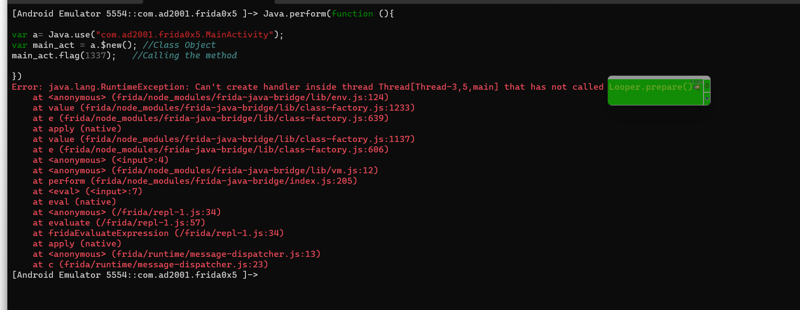

## Prerequisites  

- Basics of Reverse Engineering using jadx.
- Ability to understand Java code.
- Capability to write small JavaScript snippets.
- Familiarity with adb.
- Rooted device.

## Challenge 0x5

Let's begin our challenge. I hope you have already installed this application.



Just like other challenges, there's nothing in the UI. Let's see what we can find in Jadx.



In the `MainActivity`, there is a method called `flag` that is not called anywhere in the program. This method decrypts the flag and sets it in the TextView. Additionally, note that we have to pass the value `1337` as an argument to bypass the `if` check. We encountered a similar situation in our previous post, but this time, it's within the `MainActivity`. Why not create another instance of `MainActivity` and call this method? Let's give that a try.

- Package name : `com.ad2001.frida0x5`
- Class name : `MainActivity `
- Function name :  `flag` 

Let's review the template again.

```
Java.perform(function (){
 
var <class_reference>= Java.use("<package_name>.<class>");
var <class_instance> = <class_reference>.$new(); //Class Object
<class_instance>.<method>();   //Calling the method

})
```

```
Java.perform(function (){
 
var a= Java.use("com.ad2001.frida0x5.MainActivity");
var main_act = a.$new(); //Class Object
main_act.flag(1337);   //Calling the method

})
```

Let's start frida.

```
frida -U -f com.ad2001.frida0x5 
```



Well it crashed. So what's the reason for this ?

Creating an instance of `MainActivity` or any Android  component directly using Frida can be tricky due to Android's lifecycle  and threading rules. Android components, like `Activity`  subclasses, rely on the application context for proper functioning. In  Frida, you might lack the necessary context. Android UI components often require a specific thread with an associated `Looper`. If you're dealing with UI tasks, ensure you're on the main thread with an active `Looper`. Activities are part of the larger Android application lifecycle. Creating an instance of `MainActivity` might need the app to be in a specific state, and managing the entire lifecycle through Frida might not be straightforward. In conclusion, it's not a good idea to create an instance for the `MainActivity`.

So what's the solution here ?

When an Android application starts, the system creates an instance of the `MainActivity` (or the launcher activity specified in the AndroidManifest.xml file). The creation of the `MainActivity` instance is part of the Android application lifecycle. So we can just use frida to get the instance of `MainActivity` then call the `flag()` method to get our flag.

## Invoking methods on an existing instance

For invoking methods on an existing instance can be easily done by frida. For this we will be using an two APIs.

- `Java.performNow` : function that is used to execute code within the context of the Java runtime. 

- `Java.choose`: enumerates through instances of the specified Java class (provided as the first argument) at runtime. 

Let me show you a template.

```
Java.performNow(function(){
Java.choose('<Package>.<class_Name>', {
  onMatch: function(instance) {
    // TO DO//
  },
  onComplete: function() {}
});
});
```

There are two callbacks in this:

- **onMatch**
  - The `onMatch` callback function is executed for each instance of the specified class found during the `Java.choose` operation. 
  - This callback function receives the current instance as its parameter.
  - You can define custom actions within the `onMatch` callback to be performed on each instance.
  - `function(instance) {}`, the `instance` parameter represents each matched instance of the target class. You can use any other name you want.
- **onComplete**
  - The `onComplete` callback performs actions or cleanup tasks after the `Java.choose`operation is completed. This block is optional, and you can choose to leave it empty if you don't need to perform any specific actions after the search is finished.

Now we know how to use the `Java.choose` API, let's start writing our frida script.

- Package name : `com.ad2001.frida0x5`
- Class name : `MainActivity `
- Function name :  `flag` 

```
Java.performNow(function(){
Java.choose('com.ad2001.frida0x5.MainActivity', {
  onMatch: function(instance) {
    // TO DO//
  },
  onComplete: function() {}
});
});
```

Let's include a `console.log` statement to print a message when it successfully finds an instance of `MainActivity`. We can leave the `onComplete` block empty since we don't have anything specific to do after the enumeration is complete.

```javascript
Java.performNow(function(){
Java.choose('com.ad2001.frida0x5.MainActivity', {
  onMatch: function(instance) {
   console.log("Instance found");
  },
  onComplete: function() {}
});
});
```

Let's start frida and inject our script.

```
 frida -U -f com.ad2001.frida0x5
```


Unfortunately, it crashed. If you encounter a crash similar to this,  where the registers and their values are printed out, then you might be unlucky. This is not an issue with our script. I have encountered this multiple times, but sometimes it works. If this happens, try with another virtual device, and always use the latest version of Frida. However, I had no problems with my physical device,the script works fine for that. Anyways if you have a fix please let me know.

Let me show the output when i run this in my physical device.


It works fine for some reason. 

So the instance for our `MainActivity` is found. Okay, now let's call the `flag()` method and pass the value 1337. We can simply use the `.<function_name>()` as we did in our previous post.

```javascript
Java.performNow(function(){
Java.choose('com.ad2001.frida0x5.MainActivity', {
  onMatch: function(instance) {     //"instance" is the instance for the MainActivity
   console.log("Instance found");   
   instance.flag(1337); //Calling the function
  },
  onComplete: function() {}
});
});
```

Let's now run the script.


If we check the app again and we can see the flag in the textview.
