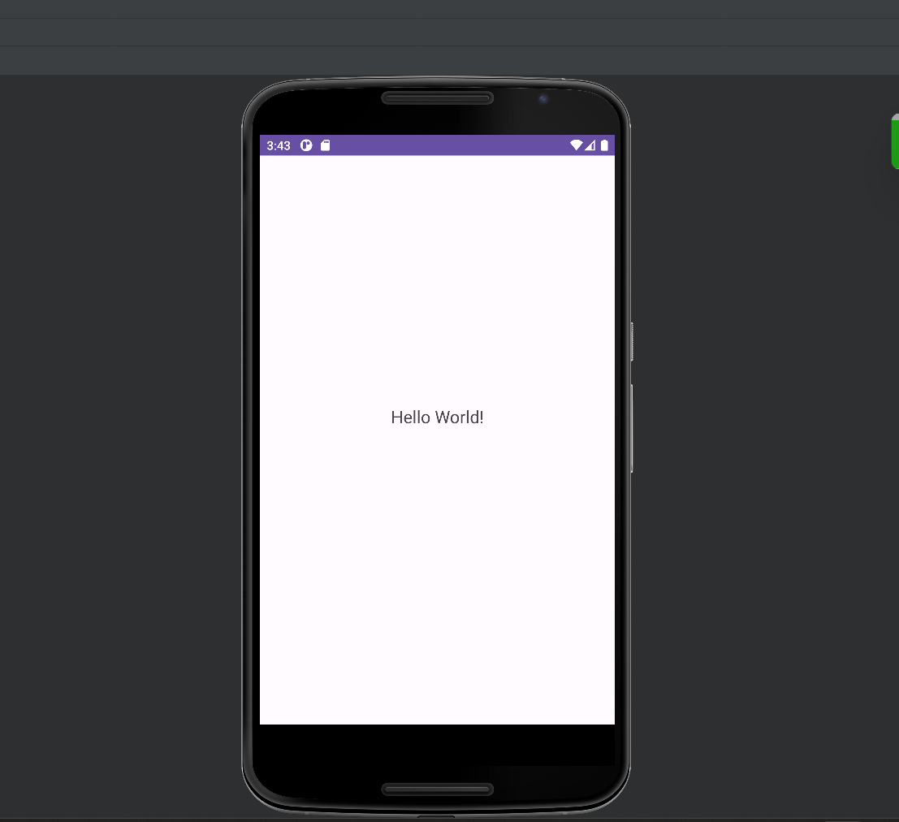
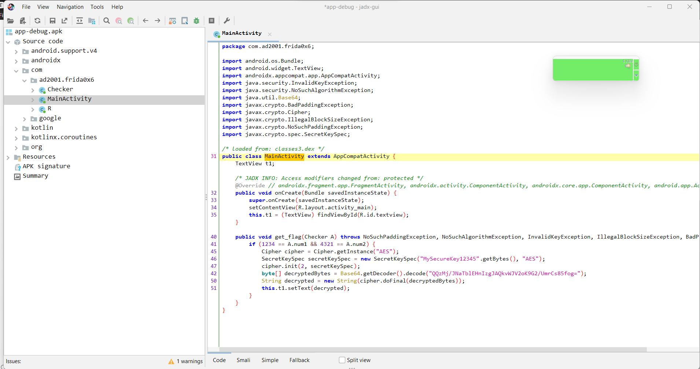
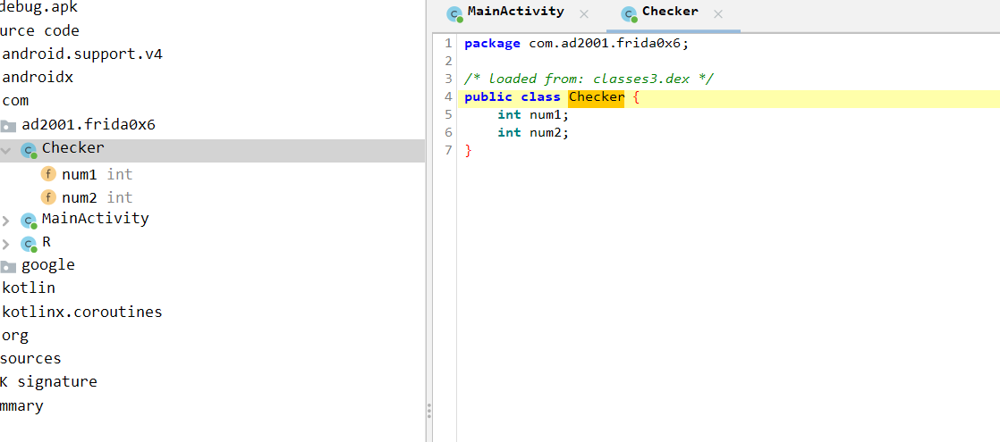
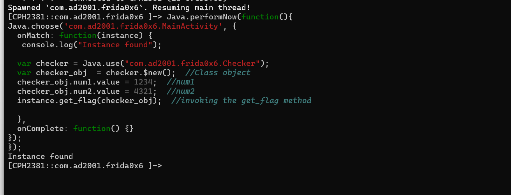

## Prerequisites  

- Basics of Reverse Engineering using jadx.
- Ability to understand Java code.
- Capability to write small JavaScript snippets.
- Familiarity with adb.
- Rooted device.

## Challenge 0x6

Let's start by installing our apk and opening it.



Just like our previous challenges, there's nothing. Let's use jadx.



We have already solved a similar one before. In this case, we have a `get_flag()`  method which is not called anywhere in the application. If we call this method, it will decrypt the flag using `AES` and sets the flag in the Textview. If we examine the `get_flag` method it only takes one argument , which is an instance of the `Checker` class. The argument is named `A`, and its type is `Checker`. 

```
public void get_flag(Checker A) throws NoSuchPaddingException, NoSuchAlgorithmException, InvalidKeyException, IllegalBlockSizeException, BadPaddingException {
    // Method body
}
```

Inside the method, it checks whether `A.num1` is equal to `1234` and `A.num2` is equal to `4321`. If the condition is true, the method proceeds to decrypt an encrypted  string using AES and sets the decrypted result in a TextView . So let's examine the Checker class.



In the Checker class, we have two variables.

- num1
- num2

`num1` should be equal to `1234` and `num2` should be equal to `4321` to satisfy the `if` condition to execute the block that will decrypt and set the flag. Remember there's also no instance of this class.

## Solution

This is very easy to solve because we already did this in the previous post, the only difference is that the argument to the `get_flag` method is an object of the `Checker` class. I will conclude the steps to solve this below:

- Create a instance of the `Checker` class.
- Set `num1` to1234 and `num2` to 4321.
- Get the instance  of `MainActivity`.
- Call the `get_flag` method using the instance as the argument.

Let's start writing our frida script.

First let's create the instance of the `Checker` class.

```
  var checker = Java.use("com.ad2001.frida0x6.Checker");
  var checker_obj  = checker.$new();  //Class object
```

Set the values of `num1` and `num2`.

```
     if (1234 == A.num1 && 4321 == A.num2) {
        ........
        ........
        ........
        }
```

```
 checker_obj.num1.value = 1234;
 checker_obj.num2.value = 4321;
```

Now let's get the instance of `MainActivity`. For this we can use `Java.performNow` and `Java.choose` APIs. We already did this in the previous challenge.

```javascript
Java.performNow(function(){
Java.choose('com.ad2001.frida0x6.MainActivity', {
  onMatch: function(instance) {
   console.log("Instance found");
   

  },
  onComplete: function() {}
});
})
```

Let's update the script with instance of the `Checker` class.

```javascript
Java.performNow(function(){
Java.choose('com.ad2001.frida0x6.MainActivity', {
  onMatch: function(instance) {
   console.log("Instance found");
   
  var checker = Java.use("com.ad2001.frida0x6.Checker");
  var checker_obj  = checker.$new();  //Class object
  checker_obj.num1.value = 1234;
  checker_obj.num2.value = 4321;


  },
  onComplete: function() {}
});
});
```

Now the only thing left to do is to call the `get_flag` method by passing the instance of the `Checker` class.

```javascript
Java.performNow(function(){
Java.choose('com.ad2001.frida0x6.MainActivity', {
  onMatch: function(instance) {
   console.log("Instance found");
   
  var checker = Java.use("com.ad2001.frida0x6.Checker");
  var checker_obj  = checker.$new();  //Class object
  checker_obj.num1.value = 1234;  //num1
  checker_obj.num2.value = 4321;  //num2
  instance.get_flag(checker_obj);  //invoking the get_flag method

  },
  onComplete: function() {}
});
});
```

Let's start frida and run our script.

```
PS C:\Users\ajind> frida -U -f com.ad2001.frida0x6
```



Now if we check our phone, the textview will have the flag.


