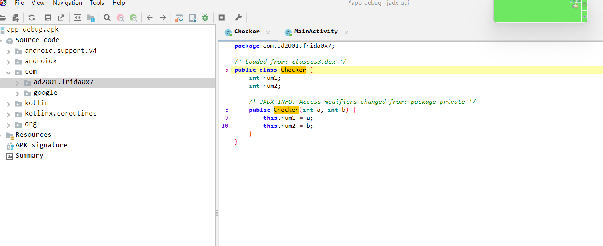

## Prerequisites

- Basics of Reverse Engineering using jadx.
- Ability to understand Java code.
- Capability to write small JavaScript snippets.
- Familiarity with adb.
- Rooted device.

## Challenge 0x7

This challenge is similar to challenge 0x5, but there's a tiny difference. In this challenge, we will learn how to hook the constructor. So let's install the apk.


Ah yes... Our plain old  "Hello World!" . Let's use jadx to see the decompilation.


We can observe a similar pattern to our previous challenges, but this time the `flag` method is called! However, as the values of `num1` and `num2` don't satisfy the `if` condition, so we won't get the flag. Let's take a look at the `Checker` method.



This time, we have a constructor that takes two integer values. These values are assigned to the local variables `num1` and `num2`. To obtain the flag, `num1` and `num2` should be greater than 512.

```java
public void flag(Checker A) throws NoSuchPaddingException, NoSuchAlgorithmException, InvalidKeyException, IllegalBlockSizeException, BadPaddingException {
    if (A.num1 > 512 && 512 < A.num2) {
        ...
        ...
        ...
    }
}
```

One way to solve this is by obtaining an instance or creating an instance of the `Checker` class and changing the values of the variables. Then, we can get the instance of the `MainActivity` and call the `flag` function with the instance of the `Checker` class. We have already learned how to do this before. The only difference is that we now have a constructor. When using the `$new` operator, pass the arguments in the brackets for the constructor.

```javascript
var checker_obj = checker.$new(600, 600); // Class Object
```

Anyways, we can easily solve this by the below script.

```javascript
Java.performNow(function() {
  Java.choose('com.ad2001.frida0x7.MainActivity', {
    onMatch: function(instance) {
    console.log("Instance found");

    var checker = Java.use("com.ad2001.frida0x7.Checker");
    var checker_obj  = checker.$new(600, 600); // Class Object
    instance.flag(checker_obj); // invoking the get_flag method
  },
    onComplete: function() {}
  });
});
```


We got the flag easily but let's do it by hooking the constructor

## Hooking the constructor

It's very easy to hook the constructor. it's similar to hooking a method. Let me provide you a template.

```javascript
Java.perform(function() {
  var <class_reference> = Java.use("<package_name>.<class>");
  <class_reference>.$init.implementation = function(<args>){

    /*

    */

  }
});
```

As we can see for hooking the constructor, we can use the `$init` keyword.

Let's try to hook the constructor `Checker` method.

```javascript
Java.perform(function() {
  var a =  Java.use("com.ad2001.frida0x7.Checker");
  a.$init.implementation = function(param){
    // TODO
  }
});
```

Okay, now let's call the original constructor with the values greater than 512, so that they will be assigned to `num1` and `num2`. This is similar to calling the original method we did before.

```javascript
Java.perform(function() {
  var a =  Java.use("com.ad2001.frida0x7.Checker");
  a.$init.implementation = function(param){
    this.$init(600, 600);
  }
});
```

Now let's start Frida with this script. As you know, the constructor will be invoked when an instance is created. In our application, an instance of the `Checker` class is created in the `onCreate` method. Therefore, we have to load this script at runtime using the `-l` option.

```
PS C:\Users\ajind> frida -U -f com.ad2001.frida0x7 -l .\Downloads\hook.js
```


And we got our flag.  So this is how we hook and manipulate constructors using frida.
