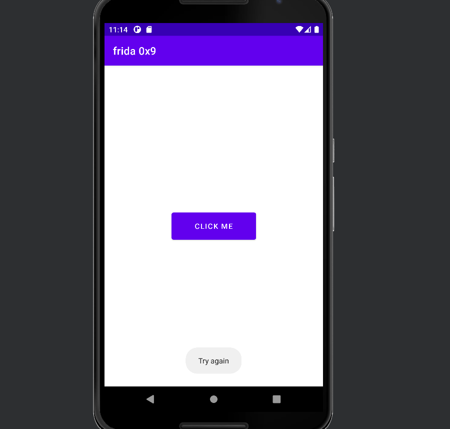
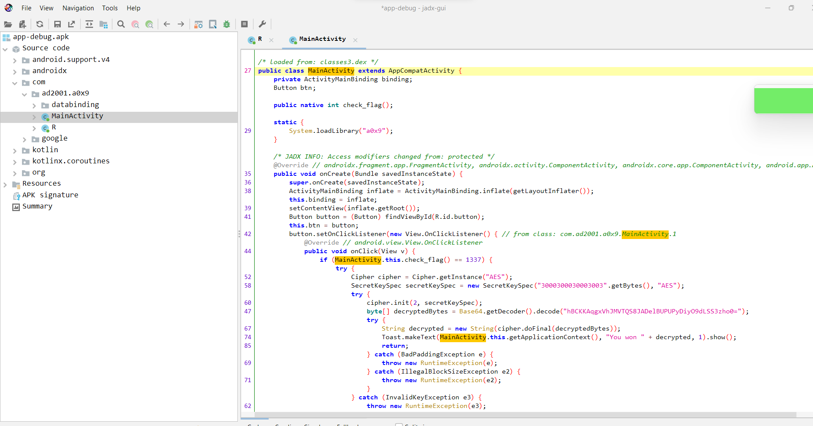
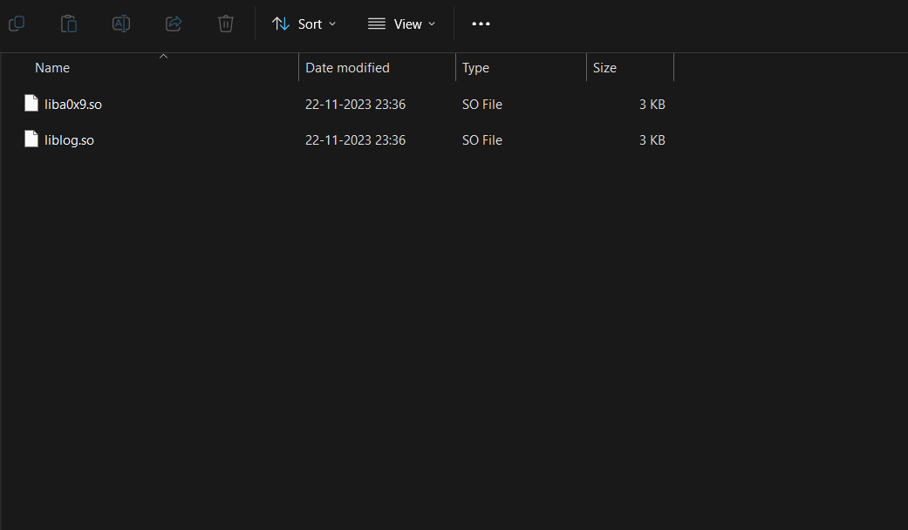
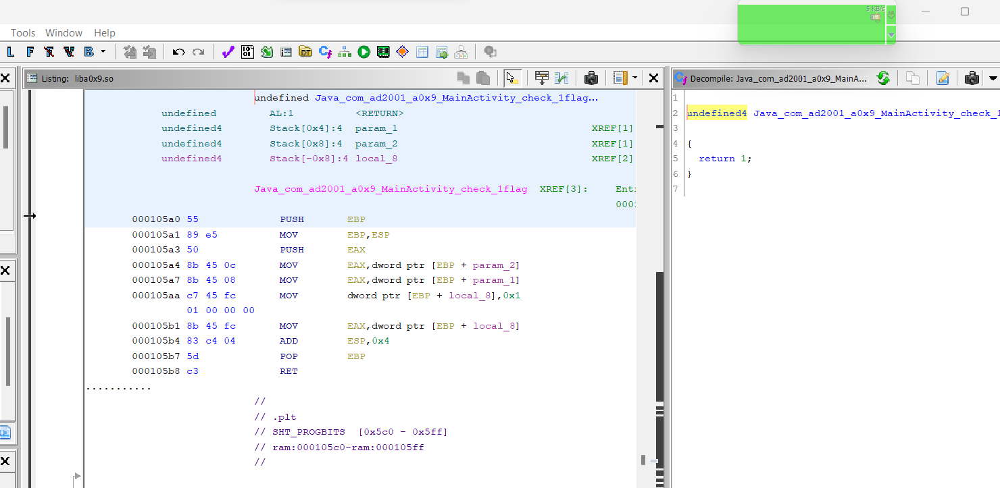
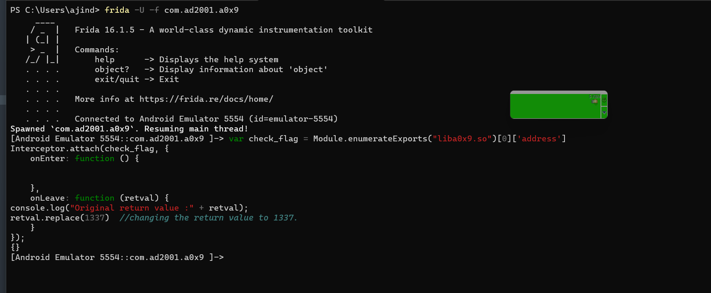
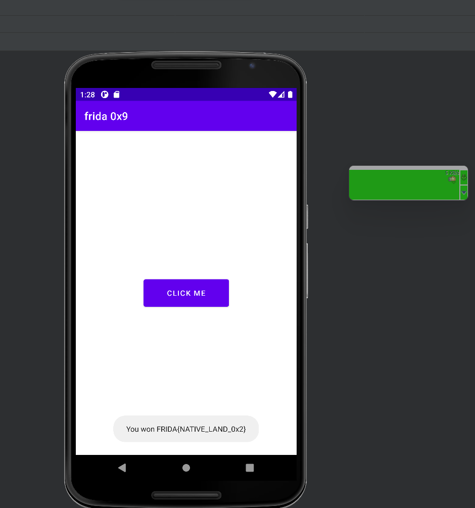

## Prerequisites  

- Basics of Reverse Engineering using jadx.
- Ability to understand Java code.
- Capability to write small JavaScript snippets.
- Familiarity with adb.
- Rooted device.
- Basics of  x64/ARM64 assembly and reversing.

## Challenge 0x9

Let's start by installing the application.


We only have a button. Let's try clicking it.



Okay, let's try using jadx.



At the start of the app, we come across the declaration of the native function. The `check_flag` function is defined in the `a0x9` library. This function takes no arguments and returns an integer. When the button is clicked, the return value from the `check_flag` method is compared with 1337. If they match, it decrypts the flag and displays it else, it prints 'Try again'. So to get the flag we should make the `check_flag` method return 1337.

So why are we wasting time here? Let's decompile the app and analyze the `a0x9` library.



Let's load this library in ghidra.




Surprisingly, there's nothing in this function. It just returns 1. So, to obtain the flag, we can simply hook this method and make it return `1337`. Also notice that the name of this function in the native space is `Java_com_ad2001_a0x9_MainActivity_check_1flag`.

Let's start writing our frida script.

```javascript
Interceptor.attach(targetAddress, {
    onEnter: function (args) {
        console.log('Entering ' + functionName);
        // Modify or log arguments if needed
    },
    onLeave: function (retval) {
        console.log('Leaving ' + functionName);
        // Modify or log return value if needed
    }
});

```

First we need the address for `check_flag` method. For this, we can use the ` Module.enumerateExports` API.


```javascript
var check_flag = Module.enumerateExports("liba0x9.so")[0]['address']
Interceptor.attach(check_flag, {
    onEnter: function (args) {
      
    },
    onLeave: function (retval) {

    }
});

```

Now the only thing left to do is to change the return value.  We can leave the `onEnter` block empty and use the `onLeave` block to change the return value. The `retval` contains the original return value. We can change this using `retval.repalce()`.

Let's do that.

```javascript
var check_flag = Module.enumerateExports("liba0x9.so")[0]['address']
Interceptor.attach(check_flag, {
    onEnter: function () {
    
      
    },
    onLeave: function (retval) {
	console.log("Original return value :" + retval);
	retval.replace(1337)  //changing the return value to 1337.
    }
});
```

Let's run this script and see what happens.



Let's click on the button and see if we get our flag.




And we got our flag easily.
