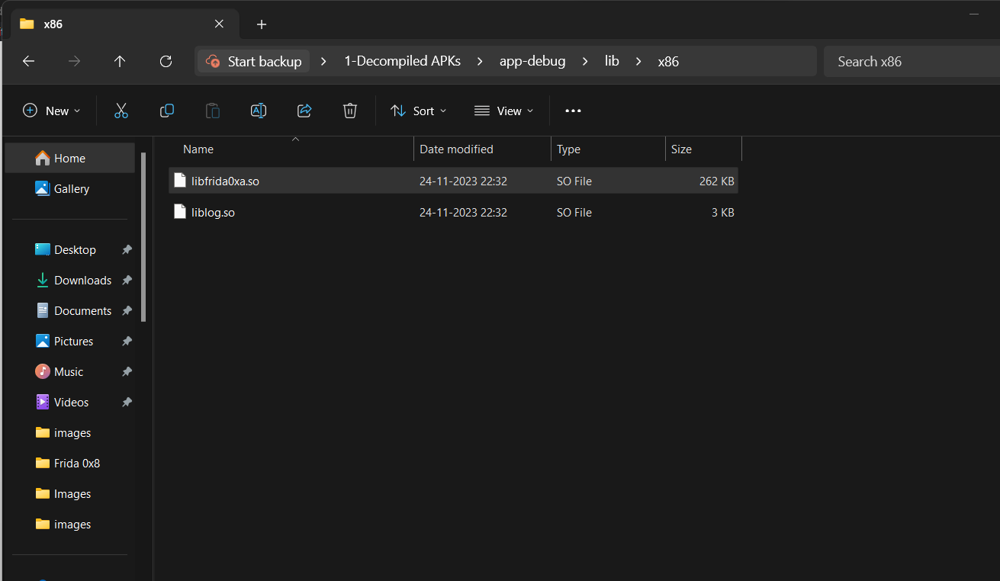
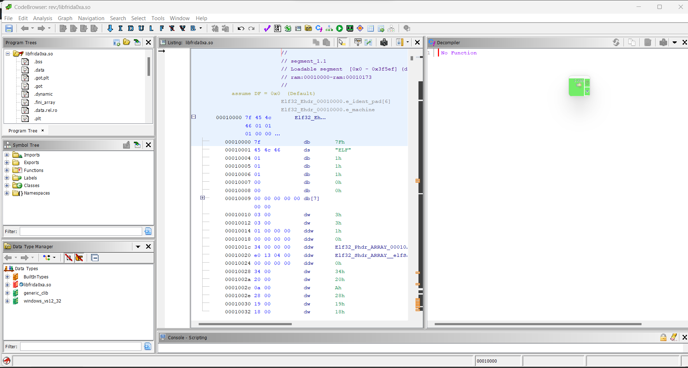
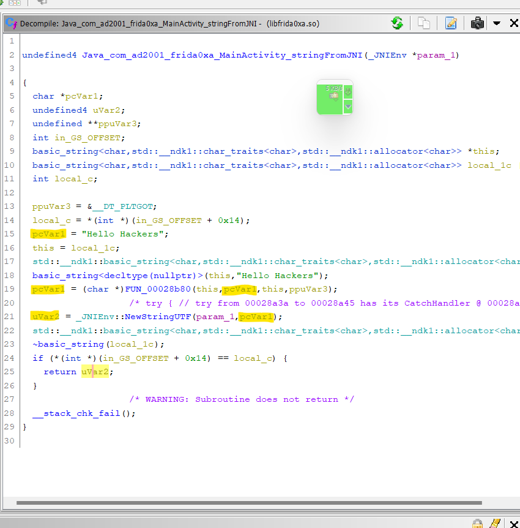
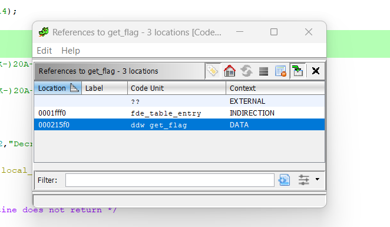
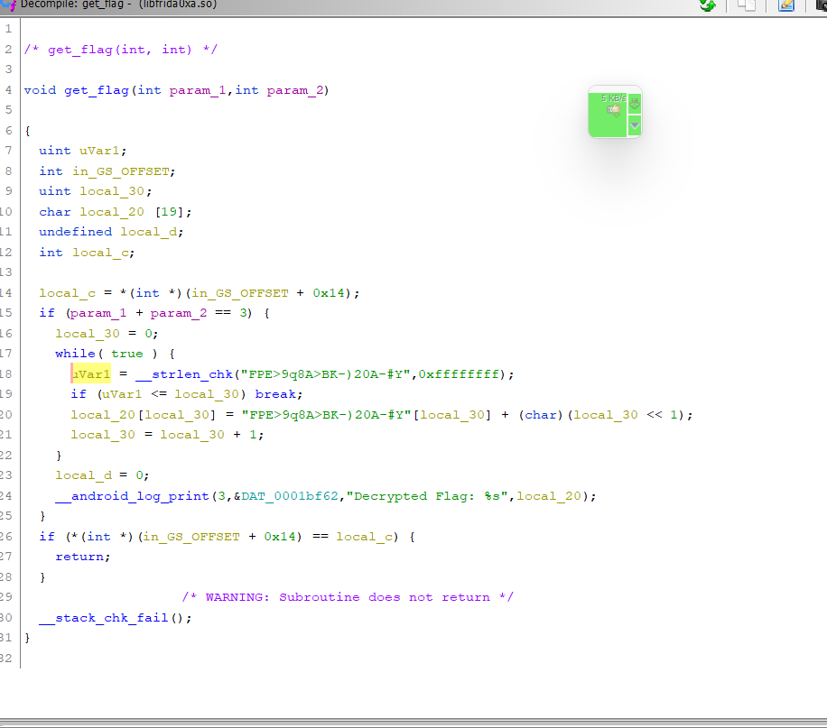
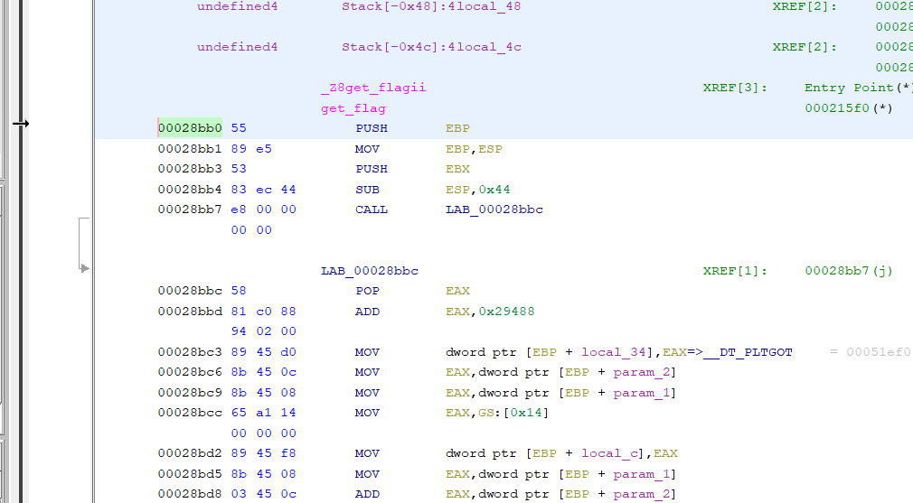

## Prerequisites

- Basics of Reverse Engineering using jadx.
- Ability to understand Java code.
- Capability to write small JavaScript snippets.
- Familiarity with adb.
- Rooted device.
- Basics of x86/ARM64 assembly and reversing.

## Challenge 0xA

Let's start by installing the application.


As usual let's use jadx.


This is exactly like our previous apk but this time the apk is developed in kotlin. We can see it's loading the `frida0xa` library at the bottom.

```java
static {
    System.loadLibrary("frida0xa");
}
```

We can also see a JNI method at the beginning.


This function returns a string. We see that the app calls this method from the `frida0xa.so` library and sets the text in the `TextView`. This is the text "Hello Hackers," which is then displayed in our `TextView`. Okay let's decompile this apk using apktool and examine the library.



Let's load this into ghidra.



It's done analyzing. Now let's see the functions.


We have two functions.

- `get_flag()`
- `Java_com_ad2001_frida0xa_MainActivity_stringFromJNI()`

We already know that our textview is calling the `stringFromJNI()` method to set the text "Hello Hackers". You can confirm this by checking the  decompilation.



The next function is the `get_flag()` method. This function wasn't declared in the Java space, and it's also not being called from anywhere in the library. You can confirm this by checking its cross-reference. The only reference is in the (Frame Description Entry)  FDE table.




Let's examine the decompilation of this method.



The function takes two integer values, adds them, and checks if the result is equal to 3. If it's equal to 3, there's a loop. It decodes the hardcoded string `FPE>9q8A>BK-)20A-#Y` and logs the decoded flag. So to get the flag, we need to call this method.

Yes, that's right. We are going to use frida to call this native function. How cool is that !!.

## Calling the native function

You won't believe how simple this is. Let me provide a template.

```javascript
var native_adr = new NativePointer(<address_of_the_native_function>);
const native_function = new NativeFunction(native_adr, '<return type>', ['argument_data_type']);
native_function(<arguments>);
```

Let me explain this line by line.

```javascript
var native_adr = new NativePointer(<address_of_the_native_function>);
```

To call a native function in frida, we need an `NativePointer` object. We should  the pass the address of the native function we want to call to the NativePointer constructor. Next, we will create the `NativeFunction` object , this represents the actual native function we want to call. It creates a JavaScript wrapper around a native function, allowing us to call that native function from frida.

```javascript
const native_function = new NativeFunction(native_adr, '<return type>', ['argument_data_type']);
```

The first argument should the `NativePointer` object, Second argument is the return type of the native function, the third argument is a list of the data types of the arguments to be passed to the native function. Now we can call the method just like we did in the java space.

```javascript
native_function(<arguments>);
```

Okay, we get the idea. Let's write the script to call the `get_flag` method.

Firstly we need the address for the `get_flag` method. We can use ghidra to find the offset and add that to base address of the `libfrida0xa.so`.

```
PS C:\Users\ajind> frida -U -f com.ad2001.frida0xa
```

```
[Android Emulator 5554::com.ad2001.frida0xa ]-> Module.getBaseAddress("libfrida0xa.so")
"0xc1859000"
```



We can get the offset by substracting this address from the image base. By default ghidra loads binaries at `0x00010000` . We can find this base in the memory map.


So the offset = `0x00028bb0` - `0x00010000` = `0x18BB0`. Now we can add that to the base.

```
[Android Emulator 5554::com.ad2001.frida0xa ]-> Module.getBaseAddress("libfrida0xa.so") .add(0x18BB0)
"0xc1871bb0"
[Android Emulator 5554::com.ad2001.frida0xa ]->
```

Okay, now we got the address.

```javascript
var adr = Module.findBaseAddress("libfrida0xa.so").add(0x18BB0)
```

Next let's create the NativePointer object.

```javascript
var adr = Module.findBaseAddress("libfrida0xa.so").add(0x18BB0) //Address of the get_flag() function
var get_flag_ptr = new NativePointer(adr);
```

Now let's create the `NativeFunction` object. The first argument is `get_flag_ptr`. The second argument is the data type; here, `get_flag` is a void function, so we will pass `void`. Lastly, the `get_flag` function has two arguments, both of which are integers, so we will pass `['int', 'int']` as the third argument.

```javascript
var adr = Module.findBaseAddress("libfrida0xa.so").add(0x18BB0) //Address of the get_flag() function
var get_flag_ptr = new NativePointer(adr);
const get_flag = new NativeFunction(get_flag_ptr, 'void', ['int', 'int']);
```

Now we just call this function with the arguments. Before that, take a look at the decompilation again.

```c
if (param_1 + param_2 == 3) {
  local_30 = 0;
  while( true ) {
    uVar1 = __strlen_chk("FPE>9q8A>BK-)20A-#Y",0xffffffff);
    if (uVar1 <= local_30) break;
    local_20[local_30] = "FPE>9q8A>BK-)20A-#Y"[local_30] + (char)(local_30 << 1);
    local_30 = local_30 + 1;
  }
  local_d = 0;
  __android_log_print(3,&DAT_0001bf62,"Decrypted Flag: %s",local_20);
}
```

We need the sum of our arguments to equal `3` to pass the `if` check. So, we can pass `1` and `2` as the arguments and call the method. So the final script will look like.

```javascript
var adr = Module.findBaseAddress("libfrida0xa.so").add(0x18BB0) //Address of the get_flag() function
var get_flag_ptr = new NativePointer(adr);
const get_flag = new NativeFunction(get_flag_ptr, 'void', ['int', 'int']);
get_flag(1,2);
```

Let's run frida and try this script.


Luckily there are no errors. Let's check the logs.


Yay! We got the flag. Frida is indeed awesome :)